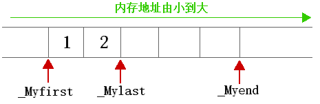
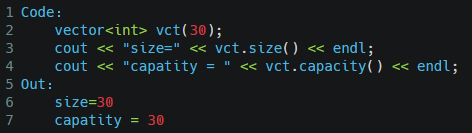
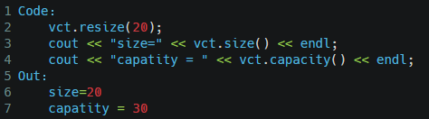
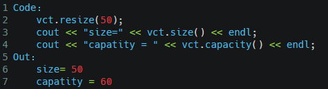
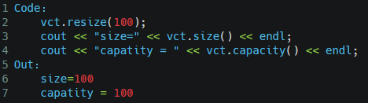
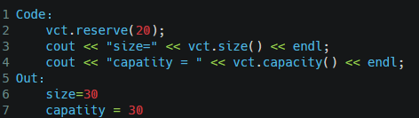
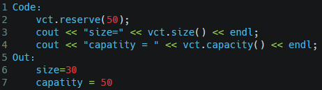

#### vector 的内部实现

***

vector 是一个顺序存储容器，所占用的内存是一段连续的内存空间。

vector 的底层来使用3个指针和分配器 allocator 实现vector对象的操作。

```cpp
template <class _Ty, class _Alloc=allocator<_Ty>>
class vector{ 
  ...
protected: 
    pointer _Myfirst; 
    pointer _Mylast;
    pointer _Myend;
}
```

其中：
-  \_Myfirst 指向的是 vector 容器对象内存的起始字节位置；
-  \_Mylast 指向当前最后一个元素的末尾字节；
-  \_Myend 指向整个 vector 容器所占用内存空间的末尾字节。
- allocator 是分配器，用于内存管理。

实现示意图：



通过将上述的指针结合，可以表达不同含义：

- _Myfirst 和 _Mylast     可以用来表示 vector 容器中目前已被使用的内存空间；
- _Mylast 和 _Myend     可以用来表示 vector 容器目前空闲的内存空间；
- _Myfirst 和 _Myend     可以用表示 vector 容器的容量。

vector 的扩容的本质：

当 vector 的大小和容量相等（size==capacity）也就是满载时，如果再向其添加元素，那么 vector 就需要扩容。vector 容器扩容的过程需要经历以下 3 步：

1. 重新申请更大的内存空间；
2. 将旧内存空间中的数据，按原有顺序移动到新的内存空间中，修改指针，添加新元素；
3. 最后将旧的内存空间释放。

_所以在扩容后迭代器可能会失效，因为迭代器仍然使用原有的地址范围。_

由此可见，vector 扩容是非常耗时的。为了降低再次分配内存空间时的成本，每次扩容时 vector 都会申请比用户需求量更多的内存空间（这也就是 vector 容量的由来，即 capacity>=size），以便后期使用。

_vector 容器扩容时，不同的编译器申请更多内存空间的量是不同的。以 VS 为例，它会扩容现有容器容量的 50%。_

vector 与 array 的区别
vector 的数据安排以及操作方式，与 array 非常相似。两者的唯一区别在于空间的运用的灵活性。

- array是静态空间，一旦配置了就不能改变；
- vector是动态空间；当元素的个数达到最大容量时，vector会重新申请空间。vector 首先配置一块新空间，然后将元素从旧址一一搬往新址，再把原来的空间释还给系统。  

vector维护的是一个连续线性空间，所以vector支持随机存取 。

vector 的 resize 和reserve：
resize用于改变vector的大小，reserve用于改变capatity大小。在使用vector时，主动使用reserve提前分配空间，防止多次重新分配复制消耗时间
定义一个指定大小的vector对象：



1、当resize的参数小于原有大小时，size和capatity的变化：size变小，capatity不变



2、当resize的参数大于原有大小时，size和capatity的大小变化：size变为指定大小；而capatity大小根据指定大小不同而不同：当大小小于原有大小的二倍，其值变为原来的二倍



当指定大小大于原有大小的 2 倍，则capatity值变为指定大小。



3、当reserve的参数小于原有大小时，size大小不变，capatity大小不变



4、当 reserve 大小大于原有大小时，size 的大小不变，capatity 的大小变为指定大小




