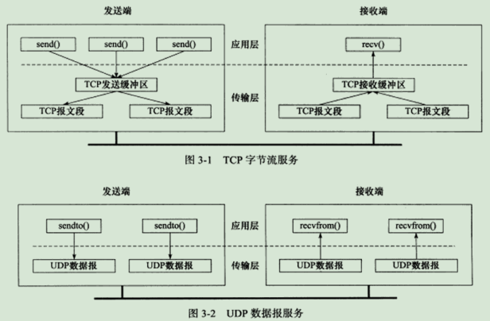
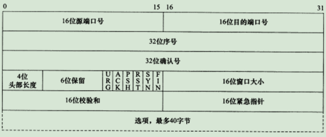
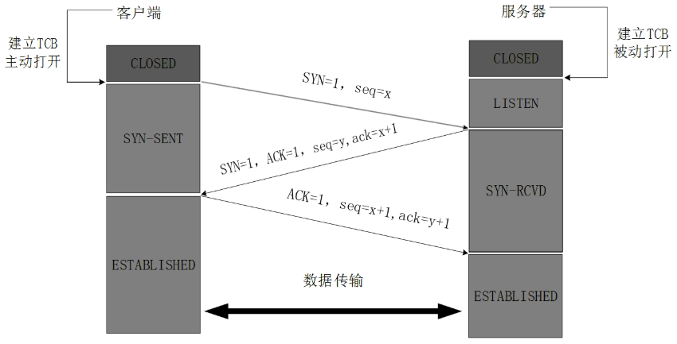
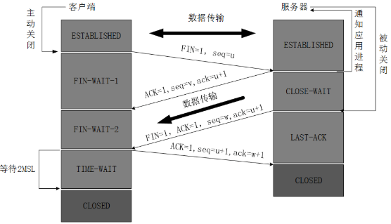
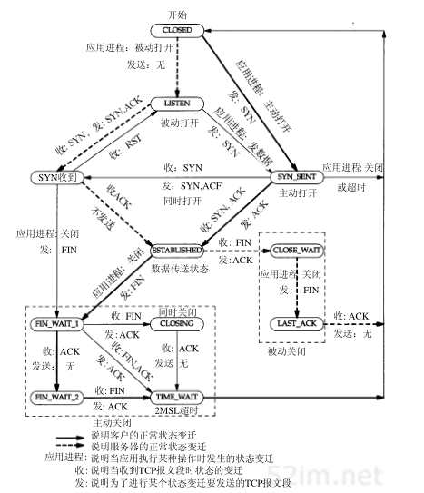

###  TCP 协议

***

**TCP** **链接的特点**：

① 面向连接：使用 TCP 协议通信的双方必须先建立链接，然后才能开始数据的传输。双方必须位该连接分配必要的内核资源，用来管理连接和连接上数据的传输。

② 全双工：双方的数据读写可以通过一个连接进行。

③点对点：TCP的连接是一对一。

④面向字节流传输：应用程序对数据的发送和接收是没有界限的。

⑤ 可靠传输：依赖应答机制、超时重传、序号。

***

#### TCP 的头部结构

①端口号：16位，分为目的端口号和源端口号。用于寻找发送端和接收端的应用进程。这两项加上IP首部中的IP地址能够唯一确定一个TCP连接。

②序号：32位，指一次TCP通信（从TCP连接建立到断开）过程中某一个方向上的字节流的每个字节的编号。值为TCP所携带报文段的第一个数据在整个数据中的位置。TCP用序号对每个数据字节进行技术。当建立或终止一个连接时，SYN或FIN被设置成1，并且需要消耗一个序列号。

③确认号：32位，期望收到对方的下一个报文段的序号。确认号的值是已经成功接收到的数据字节的序号加1。只有`ACK`=1时，确认号才有效。

④首部长度：4位，单位为 4 B，最大为60，一般为 20 B。因为首部长度可变。

⑤6 位标志：

- `URG` 标志：标识紧急指针是否有效
- `ACK `标志：表示确认号是否有效。带有`ACK`标志的报文为确认报文段。
- `PSH`标志：当设置为1时，表示提示接收端应用立即从TCP接收缓冲区区中立即读取数据。
- `RST`标志：表示要求对方立即重新建立连接。带有`RST`标志的TCP报文段为复位报文段。
- `STN`标志：请求建立一个连接。带有`SYN`标志的报文段为同步报文段。
- `FIN`标志：通知对方本端要关闭连接。带有`FIN`标志的TCP报文段为结束报文段。

⑥ 窗口大小：16位，接收窗口的大小。是TCP流量控制的一个手段。用于告诉对方本端的TCP接收缓冲区还能容纳多少数据。

⑦ 校验和：16位，由发送端填充，接收端执行`CRC`算法以检验TCP 报文段在传输过程中是否损坏。校验所有，是可靠传输的一个保障。

⑧紧急指针，16位，是一个正的偏移量。它和序号的值相加表示紧急数据的下一个字节的序号。用于发送端向接收端发送紧急数据。

***

#### TCP连接的建立—三次握手

因为整个过程没有发生应用层数据的交换，所以TCP报文段的数据部分的长度为0。最开始的时候客户端和服务器都是处于`CLOSED`状态。主动打开连接的为客户端，被动打开连接的是服务器。

① TCP服务器进程先创建传输控制块`TCB`，时刻准备接受客户进程的连接请求，此时服务器就进入了LISTEN（监听）状态；

② TCP客户进程也是先创建传输控制块`TCB`，然后向服务器发出连接请求报文，这是报文首部中的同部位SYN=1，同时选择一个初始序列号 `seq=x `，此时，TCP客户端进程进入了 SYN-SENT（同步已发送状态）状态。TCP规定，SYN报文段（`SYN=1`的报文段）不能携带数据，但需要消耗掉一个序号。

③ TCP服务器收到请求报文后，如果同意连接，则发出确认报文。确认报文中应该 `ACK=1`，`SYN=1`，确认号是`ack=x+1`，同时也要为自己初始化一个序列号 `seq=y`，此时，TCP服务器进程进入了`SYN-RCVD`（同步收到）状态。这个报文也不能携带数据，但是同样要消耗一个序号。

④ TCP客户进程收到确认后，还要向服务器给出确认。确认报文的`ACK=1`，`ack=y+1`，自己的序列号`seq=x+1`，此时，TCP连接建立，客户端进入ESTABLISHED（已建立连接）状态。TCP规定，`ACK`报文段可以携带数据，但是如果不携带数据则不消耗序号。

⑤ 当服务器收到客户端的确认后也进入`ESTABLISHED`状态，此后双方就可以开始通信了。

***

#### TCP的释放—四次挥手

数据传输完毕后，双方都可以释放连接。最开始的时候，客户端和服务端都处于`ESTABLISHED`状态。每一端都能主动关闭连接。

① 客户端进程发出连接释放报文，并停止发送数据。释放数据报文首部，`FIN=1`，其序列号为`seq=u`（等于前面已经传送过来的数据的最后一个字节的序号加1），此时，客户端进入`FIN-WAIT-1`（终止等待1）状态。 TCP规定，FIN报文段即使不携带数据，也要消耗一个序号。

② 服务器收到连接释放报文，发出确认报文，`ACK=1`，`ack=u+1`，并且带上自己的序列号seq=v，此时，服务端就进入了`CLOSE-WAIT`（关闭等待）状态。TCP服务器通知高层的应用进程，客户端向服务器的方向就释放了，这时候处于半关闭状态，即客户端已经没有数据要发送了，但是服务器若发送数据，客户端依然要接受。这个状态还要持续一段时间，也就是整个`CLOSE-WAIT`状态持续的时间。

③ 客户端收到服务器的确认请求后，此时，客户端就进入`FIN-WAIT-2`（终止等待2）状态，等待服务器发送连接释放报文（在这之前还需要接受服务器发送的最后的数据）。

④ 服务器将最后的数据发送完毕后，就向客户端发送连接释放报文，FIN=1，`ack=u+1`，由于在半关闭状态，服务器很可能又发送了一些数据，假定此时的序列号为`seq=w`，此时，服务器就进入了`LAST-ACK`（最后确认）状态，等待客户端的确认。

⑤ 客户端收到服务器的连接释放报文后，必须发出确认，`ACK=1`，`ack=w+1`，而自己的序列号是`seq=u+1`，此时，客户端就进入了TIME-WAIT（时间等待）状态。注意此时TCP连接还没有释放，必须经过`2∗MSL`（最长报文段寿命）的时间后，当客户端撤销相应的`TCB`后，才进入`CLOSED`状态。

⑥ 服务器只要收到了客户端发出的确认，立即进入`CLOSED`状态。同样，撤销`TCB`后，就结束了这次的TCP连接。可以看到，服务器结束TCP连接的时间要比客户端早一些。

***

####  状态转移图

服务器TCP 状态转移

**建立连接时**：服务器通过listen系统调用进入LISTEN状态，被动等待客户端连接，因此执行的是所谓的被动打开。服务器一旦监听到某个连接请求（收到同步报文段），就将该连接放入内核等待队列中，并向客户端发送带SYN标志的确认报文段。此时连接处于`SYN_RCVD`状态。如果服务器成功接收到客户端发送回的确认报文段，则该连接转移到`ESTABLIHED`状态。ESTABLISHED状态是连接双方能够进行双向数据传输的状态。

**关闭连接时**：当客户端主动关闭连接时（通过close或shutdown系统调用向服务器发送结束报文段），服务器通过接收到FIN报文段并返回确认报文段，由ESTABLISHED进入到CLOSE_WAIT状态，即等待服务器关闭连接。当服务器没有数据发送给客户端时，会立即发送给客户端一个结束报文段来关闭连接。这将是连接转移到`LAST_ACK`状态，等待客户端对结束报文段的最后一次确认。一旦确认，状态变为 `CLOASED`。

客户端TCP状态转移

**建立连接时**：客户端通过connect系统调用主动与服务器建立连接。connect系统调用首先给服务器发送一个同步报文段，使连接转移到`SYN_SENT`状态。当客户端接收到服务器的同步报文和确认，则connect调用成功返回，连接转移到`ESTABLISHED`状态。

**关闭连接时**：当客户端主动关闭连接时，向服务端发送一个结束报文段（含FIN字段的报文段），同时连接由`ESTABLISHED`状态变为`FIN_WAIT_1`状态。若客户端收到服务器服务器的专门用于确认目的确认报文段，则将连接转移至`FIN_WAIT_2`状态，此时服务器的状态为`CLOSE_WAIT`状态。当接受到服务发送的请求关闭连接报文段，则客户端将返回确认报文，并进入`TIME_WAIT`状态。

***

#### TCP超时重传

答：TCP 服务必须能够重传超时时间没有收到确认的TCP报文段。TCP模块为每个TCP报文段都维护一个定时器，该定时器在TCP报文段第一次被发送时启动。如果超过时间没有收到应答，TCP模块将重新发送此TCP报文段并重新设置定时器。

***

#### 拥塞控制

拥塞控制的作用：提高网络利用率，降低丢包率，并保证网络资源对每条数据流的公平性。拥塞控制包括四个部分：慢启动、拥塞避免、快速重传和快速恢复。

(待补充)

***

#### 其他问题

关于TCP的问题

1、为什么TCP要三次握手？

答：为了防止已经失效的请求链接报文，又重新出现在服务器。

2、为什么关闭连接时，要四次挥手？

答：因为TCP连接是全双工，每个方向的连接可以单独关闭。当一方的数据发送完毕就可以发送一个FIN来终止这个连接。当一端收到一个FIN报文，他必须向另一端发送确认接收报文。

3、为什么客户端最后还要等待 `2MSL`？

答：①保证四次挥手的最后一个`ACK`报文能够到达服务器。

②防止已经失效的请求连接报文重新出现在服务器端。

4、如果已经建立了连接，但是客户端突然出现故障了怎么办？

答：TCP还设有一个保活计时器，显然，客户端如果出现故障，服务器不能一直等下去，白白浪费资源。服务器每收到一次客户端的请求后都会重新复位这个计时器，时间通常是设置为2小时，若两小时还没有收到客户端的任何数据，服务器就会发送一个探测报文段，以后每隔75秒发送一次。若一连发送10个探测报文仍然没反应，服务器就认为客户端出了故障，接着就关闭连接。

5、TCP的可靠传输是由内什么保证的？

① 当TCP发送一个报文段后，它同时会启动一个定时器，等待目的端确认收到报文段。如果没有及时的接收到确认时，将会重新发送这一报文。

② 应用数据被分割成最适合发送的数据块。

③ 当TCP接收到另一端发送的数据时，会发送一个确认给发送端。

④ TCP 的头部有检验和，能够校验首部和数据。目的是检验数据在传输过程中是否发生变化。

⑤ TCP会对接收到的数据进行重新排序，并将收到的数据以正确的顺序交给应用层。

⑥ TCP 接收端会舍弃重复的数据。

⑦ TCP能够提供流量控制。TCP连接的每一端都有固定大小的缓存空间。TCP的接收端只允许接收端发送接收端能够接受的大小的数据，目的是防止缓冲区溢出。

6、`MSS`是什么？`MTU`是什么？

 最大报文段长度（`MSS`）：指明本端所能接收的最大长度的报文段。当一个连接建立时，连接的双方都要通告各自的`MSS`。每个连接方通常都在通信的第一个报文段（为建立连接而设置SYN=1标志的那个段）中指明这个选项。

`MTU`表示最大传输单元，表示链路层上面所能传输的最大包。最大传输单元的值是1,500字节

7、TCP是面向字节流服务？

答：表示TCP不在字节流中插入记录标识符。

8、TCP的全双工是指？

答：能在连接的两个方向上独立的进行传输。因此连接的每一端必须保持每个方向上的独立传输数据序号。

9、HTTP的长连接和短连接的区别？

答：HTTP的长连接和短连接实际上是TCP长连接和短连接。HTTP属于应用层协议，使用传输层的TCP协议来保证可靠传输。HTTP是无状态的。当时HTTP使用短连接时，每进行一次HTTP操作时，就进行一次TCP连接，当任务结束时，就中断连接。当使用长连接时，需要在响应头部添加keep-alive，当进行一次HTTP后不会立即关闭TCP连接，保持时间可以设定。当操作频繁，点对点的通讯，而且连接数不能太多情况，长连接可以省去省去较多的TCP建立和关闭的操作，减少浪费，节约时间。长连接对于服务端来说会耗费一定的资源，不太安全。短连接对于服务器来说管理较为简单，存在的连接都是有用的连接，不需要额外的控制手段。

>参考资料：
>
>- 博客
>- 《TCP/IP 详解》（卷一）
>- 《Computer Networking A Top-Down Approach (7th Edition)》

